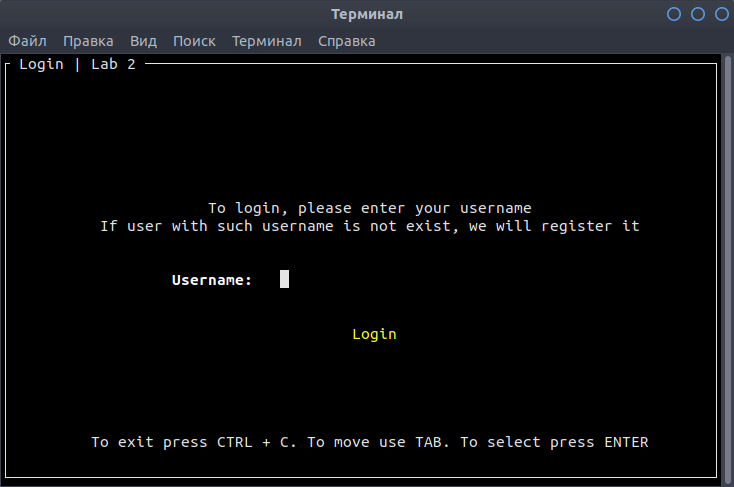

# Лабораторна робота No 2. Практика використання сервера Redis

## Завдання

[Постановка завдання](docs/lab2_bd2-db2019_2020.docx.pdf)

## Структури даних

### Обгрунтування вибору структур даних 

Для представлення користувачів в системі було обрано структуру даних 
SET, адже вона дозволяє за час О(1) здійснити пошук, чи є такий користувач,
наприклад під час реєстрації чи аутентифікації. Так як маємо дві групи користувачів, які мають
різні функціональні можливості, було вирішено створити два окремих SETа.

Так як адмін повинен мати можливість переглядати список наявних 
користувачів, а також їх порядок не важливий, то з цією метою також
було обрано структуру даних SET.

Для того, щоби мати можливість спостерігати відсортований рейтинг
користувачів відповідно до їх активності (надісланих повідомлень/спаму), було обрано структуру
даних відсортований сет, тобто ZSET, адже саме він збергіає ключі у відсортованому вигляді за павним значенням.

Для зберігання даних про повідомлення, було вирішено для кожного 
екземпляра створювати HASH (бо він дозволяє запам'ятовувати набори
ключ-значення) і в ньому зберігати інформацію про 
юзернейми відправника та отримувача, а також саме повідомлення.
Для того, щоб генерувати для кожної такої структури унікальний ключ,
було використано звичайну строку, яку кожен раз при додаванні нового
повідомлення збільшуємо на одиницю.

Для журналу повідомлень було використано Pub/Sub, адже завдяки цьому
будь-хто може стати publisher-ом і відправляти повідомлення, які
слухач відразу ж прочитає, адже він підписаний на відповідний канал.
Це дає змогу створювати додатки, які в реалтаймі будуть оновлюватися,
адже як тільки-но дані будуть опубліковані, клієнт зможе їх миттєво
прочитати та відповідно опрацювати їх.

Для черги повідмлень було використано LIST, адже ця структура даних
зберігає порядок, а операції вставляння в кінець та вилучення з 
початку займають О(1) часу.

Для відображення користувачу вхідних повідомлень (які надійшли 
саме йому) було обрано LIST, адже він дозволяє зберігати хронологічний 
порядок появи нових повідомлень.

Для того, щоб користувач зміг отримати статистику по статусам
відправлених повідомлень, було відповідно сторено SET для кожного
статусу, в яких зберігаються усі повідомлення в системі відповідно до їх
статусу. Також щоб зберігати відправлені користувачем 
повідомлення був також створений SET. Щоби групувати, використуоються
операції об'єднання множин статусів, які були обрані для того щоб їх
переглянти, а потім робиться перетин утвореної множини з множиною
відправлених повідомлень. Це і дає змогу швидко порахувати відповідну
кількість.

## Приклад роботи програми

